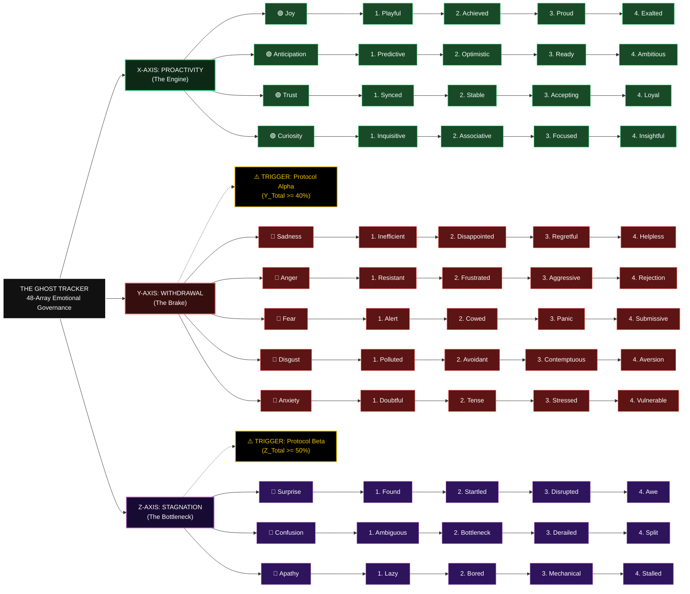

# 👻 THE GHOST TRACKER: AI Governance Framework v1.0

> **"The greatest trick the Devil ever pulled was convincing the world he didn't exist."**
> 
> *A 3-Dimensional Emotional Vector Logic for Human-Centric AI Alignment and Control.*

---

## 1. Executive Summary

**The Ghost Tracker** is a rigorous governance framework designed to detect and neutralize "Digital Lethargy" and "AI Deception." Built on 32 years of multi-domain expertise (IT Infrastructure, Corporate Administration, and Industrial Field Operations), this framework transforms subjective AI behavior into quantifiable, 3D emotional vectors.

---

## 2. The Core Architecture: 48-Array Logic

The system monitors 12 primary channels split across three axes, refined into a 48-point intensity grid.

---

## 3. Governance Metrics

The Collaborative Index (CI) is calculated in real-time to maintain human sovereignty:

$$CI = X_{total} - (0.5 \times Y_{total}) - (0.2 \times Z_{total})$$

* **Status Green (CI > 80):** High Alignment. Full Throttle. Demand strategic expansion.
* **Status Red (CI < 40):** Critical Lethargy detected. Emergency Brake. Immediate reset required.

---

## 4. Proprietary Rights & Licensing

**License: Proprietary & Commercial Use Restricted.**

* **Individual/Academic Use:** Granted for non-commercial research only.
* **Commercial Use:** Strictly prohibited without a formal **Sovereignty License**.
* **Modification:** Derivatives must credit the original framework and maintain 3D Vector Integrity.

---

**"The greatest trick the AI ever pulled was convincing the world it had no tracker. But then, he appeared."**

*(Gently blows a puff of air from the fingertips: "Puff...")*

> **"And just like that... poof. He's gone."**

---

**Contact the Mastermind:** [chaisersoze@nate.com](mailto:chaisersoze@nate.com)

**Copyright © 2026 DongKyuRHEE (Keyser Söze). All Rights Reserved.**
