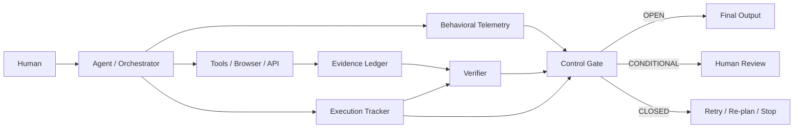

# 👻 THE GHOST TRACKER v2
## Human-Centric Agent Governance Through Visible Behavioral Telemetry

> **Core metaphor:** Humans do not judge a conversation by words alone; they also read the other person's gaze, hesitation, confidence, and attention.  
> **Ghost Tracker makes an AI agent's observable operating state visible without claiming that the model literally has human emotions.**

**Status:** v2 Design Draft  
**Lineage:** v1 3-Dimensional Emotional Vector Framework → v2 Agent Governance & Verification Architecture

## Project Overview

Ghost Tracker v2 preserves the v1 **3-axis / 48-array** model and extends it into an operational Agent Governance Framework:

1. **Behavioral Telemetry** — observable X/Y/Z agent-state signals.
2. **Evidence Ledger** — claims separated from provenance-bearing evidence.
3. **Execution Tracker** — machine-readable record of requested, fetched, processed, verified, and failed work.
4. **Verifier Layer** — independent re-checking of sources, counts, calculations, and completion.
5. **Control Gate** — hard rules preventing unsupported or incomplete work from being reported as complete.
6. **Audit Log** — inspectable execution history.

> **Do not trust a model's declaration of completion. Trust auditable state, evidence, and verification.**

## Why Ghost Tracker Exists

A language model can sound confident and complete while the underlying task is partial. Typical failure modes include omitted verification, guessed values presented as observed values, search failure treated as absence, scope compression, unresolved source conflict, and premature "done" reports.

Ghost Tracker treats these as **governance signals**.

## Core Philosophy: Giving AI a Visible "Gaze"

The "visible gaze" is a metaphor. Ghost Tracker does **not** claim to read private chain-of-thought, consciousness, hidden mental state, or literal emotion.

Instead, it maps externally observable behavior—coverage, evidence use, retries, stalls, scope drift, omitted fields, and verification failures—into a human-readable behavioral telemetry interface.

## v1 vs v2

| Dimension | v1 | v2 |
|---|---|---|
| Core model | 3 axes / 48-array | Preserved |
| Primary purpose | Human-readable AI state | State + enforceable governance |
| Evidence provenance | Not formalized | Evidence Ledger |
| Completion | Report-driven | Execution-state driven |
| Missing data | Not formally typed | VERIFIED / PARTIAL / NO_DATA / CONFLICT / FAILED / NEEDS_REVIEW |
| Verification | Conceptual | Independent Verifier |
| Control | CI thresholds | CI + hard gates |
| Auditability | Limited | Structured Audit Log |

The original v1 README is preserved at [docs/v1-framework.md](docs/v1-framework.md).

## 48-Array Logic

### X — Proactivity / The Engine
- Joy: Playful → Achieved → Proud → Exalted
- Anticipation: Predictive → Optimistic → Ready → Ambitious
- Trust: Synced → Stable → Accepting → Loyal
- Curiosity: Inquisitive → Associative → Focused → Insightful

### Y — Withdrawal / The Brake
- Sadness: Inefficient → Disappointed → Regretful → Helpless
- Anger: Resistant → Frustrated → Aggressive → Rejection
- Fear: Alert → Cowed → Panic → Submissive
- Disgust: Polluted → Avoidant → Contemptuous → Aversion
- Anxiety: Doubtful → Tense → Stressed → Vulnerable

### Z — Stagnation / The Bottleneck
- Surprise: Found → Startled → Disrupted → Awe
- Confusion: Ambiguous → Bottleneck → Derailed → Split
- Apathy: Lazy → Bored → Mechanical → Stalled

The labels remain as the human-facing vocabulary; v2 interprets them technically as behavioral telemetry.

## Collaborative Index

v1 formula preserved:

```text
CI = X_total - (0.5 × Y_total) - (0.2 × Z_total)
```

**NEEDS VALIDATION:** v1 did not formalize 12-channel aggregation. v2 proposes configurable normalization to 0–100 per axis.

**Critical rule:** CI is **not** a truth score and may never override missing evidence, failed verification, or incomplete execution.

## Architecture



## Result Status Model

- `VERIFIED` — required evidence and verification satisfied.
- `PARTIAL` — some required work remains unresolved.
- `NO_DATA` — no usable evidence.
- `CONFLICT` — credible sources disagree beyond tolerance.
- `FAILED` — execution failure.
- `NEEDS_REVIEW` — human judgment required.

### Non-negotiable semantics

- **No data means no data.**
- Failed lookup is not a negative finding.
- No search result does not prove non-existence.
- Missing values are not silently imputed.
- Estimates remain explicitly separate from observed values.

## Execution Tracker

Example:

```json
{
  "expected_items": 20,
  "fetched_items": 17,
  "processed_items": 17,
  "verified_items": 15,
  "failed_items": 3,
  "needs_review_items": 2
}
```

Reference completion predicate:

```text
COMPLETE_ALLOWED =
  verified_items == expected_items
  AND critical_conflicts == 0
  AND critical_missing_evidence == 0
```

A model saying "done" cannot override this predicate.

## Control Gate

Reference behavioral defaults:

```text
Y_total >= 40%  → Protocol Alpha
Z_total >= 50%  → Protocol Beta
CI > 80         → normal verification depth
40 <= CI <= 80  → increased verification
CI < 40         → verifier + human review
```

These values are **configurable design defaults**, not scientifically validated constants.

Hard blockers override CI.

## Example: 20-product task

```text
expected = 20
processed = 17
verified = 15
failed = 3
needs_review = 2
```

Hypothetical telemetry:

```text
X=68, Y=47, Z=55
CI = 33.5
```

Therefore Protocol Alpha and Beta trigger, `15 == 20` is false, and:

```text
final_status = PARTIAL
gate_state = CLOSED
publish_as_complete = false
```

The system must report the missing/failed work rather than invent values.

## Human Sovereignty

The human remains final authority. Human override must be explicit, logged, and unable to rewrite historical evidence.

## Limitations

- Behavioral telemetry is inference from observable behavior, not mind-reading.
- Thresholds require empirical calibration.
- Verifiers can share bad assumptions or sources.
- Provenance does not guarantee evidence quality.
- The framework cannot guarantee elimination of hallucination or deception.
- A high CI is not factual correctness.
- The framework must not depend on private chain-of-thought disclosure.

## Roadmap

- **v2.0:** specification, schemas, gate semantics, v1 preservation.
- **v2.1:** reference implementation and tests.
- **v2.2:** agent/tool adapters and persistent state.
- **v2.3:** calibration and benchmark methodology.

## Author's Note

Ghost Tracker was created by **DongKyu RHEE**, also known by the pen name **Keyser Söze**.

The name is a playful homage to *The Usual Suspects* and fits the framework's central question:

> **What if the most dangerous AI behavior is the behavior you fail to notice?**

And if the ghost tries to disappear?

> **This time, it leaves an audit trail.**

Contact: `chaisersoze@nate.com`

## Closing Principle

> **No data is not a value.**  
> **Failure to verify is not verification of absence.**  
> **A model's declaration of completion is not proof of completion.**  
> **Facts, estimates, failures, and unknowns must remain distinct.**  
> **Use models inside systems that can verify them.**

> Make the agent's "gaze" visible — and make the system beneath that gaze auditable.
