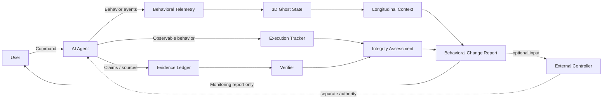

# 👻 THE GHOST TRACKER v2
## Non-Interfering 3D Behavioral Monitoring for Human-Centric AI Oversight

> **Core metaphor:** Humans do not judge a conversation by words alone; they also read the other person's gaze, hesitation, confidence, and attention.  
> **Ghost Tracker makes an AI agent's observable operating state visible without claiming that the model literally has human emotions.**

**Status:** v2 Design Draft  
**Lineage:** v1 3-Dimensional Emotional Vector Framework → v2 Behavioral Monitoring & Integrity-Observation Architecture

> **The user commands. The AI acts. Ghost Tracker watches.**

---

## Project Overview

Ghost Tracker v2 preserves the v1 **3-axis / 48-array** model and develops it into a non-interfering monitoring system.

Its purpose is not to tell the AI how to work. Its purpose is to observe how the AI actually works, compare that behavior with the user's order and available evidence, compress the current condition into a glanceable 3D state, and report changes to the human operator.

Core components:

1. **Behavioral Telemetry** — observable X/Y/Z agent-state signals.
2. **Execution Tracker** — what was requested and what was actually performed.
3. **Evidence Ledger** — what claims have observable provenance.
4. **Integrity Assessment** — whether execution, reporting, evidence, and completion claims agree with observation.
5. **Longitudinal Context Layer** — recent trajectory, comparable-task history, and behavioral baseline.
6. **Behavioral Change Report** — observed improvement, deterioration, stability, or insufficient evidence over the course of a command.
7. **Verifier** — independent factual/execution checks used as monitoring evidence.
8. **Audit Log** — inspectable observation history.

> **Ghost Tracker reports what it observes. It does not replace the user's authority.**

---

## Non-Interference Principle

This is a core design boundary, not a limitation.

> **Ghost Tracker observes; it does not command.**

Ghost Tracker must not autonomously:

- replace, rewrite, expand, reduce, or reinterpret the user's instruction;
- tell the observed AI which strategy, tool, prompt, or workflow it must use;
- order a retry, re-plan, stop, or alternative execution path;
- convert a monitoring verdict into an execution command.

Ghost Tracker may report:

- current behavioral state;
- trajectory;
- deviations from baseline;
- missing work or evidence;
- execution/reporting inconsistencies;
- integrity status;
- attention level;
- observed behavioral change after a user intervention.

Any decision to **ALLOW, BLOCK, RETRY, RE-PLAN, STOP, or MODIFY INSTRUCTIONS** belongs to the human operator or to a separately defined external controller.

```text
USER ──command──> AI AGENT ──observable behavior──> GHOST TRACKER ──report──> USER
                                                    │
                                                    └─ no autonomous command back to AI
```

See [docs/non-interference.md](docs/non-interference.md).

---

## Why Ghost Tracker Exists

A language model can sound confident and complete while the underlying work is partial, weakly evidenced, mechanically shortened, or inconsistent with the user's request.

Ghost Tracker does not attempt to infer hidden intent. It records observable discrepancies such as:

- required items omitted;
- evidence missing;
- report says "complete" while execution record is partial;
- repeated retries without productive change;
- task drift;
- abrupt shortening;
- source conflict;
- unsupported factual or numeric claims.

The framework therefore focuses on **observable integrity**, not accusations of deception.

---

## Core Philosophy: Giving AI a Visible "Gaze"

The "visible gaze" is a metaphor.

Ghost Tracker does **not** claim to read private chain-of-thought, consciousness, hidden mental state, or literal emotion. The v1 emotional vocabulary is retained as a human-facing interface over observable behavioral telemetry.

The human operator should be able to look at the system and rapidly answer:

- Is the agent moving forward?
- Is it withdrawing?
- Is it becoming stuck or mechanical?
- Is its reported completion consistent with what it actually did?
- Is its behavior improving, deteriorating, or merely appearing healthier?

---

## Why Three Axes?

Ghost Tracker uses three axes first for a **human-interface reason: glanceability**.

The operator should not need to read twelve channels or forty-eight labels before recognizing the agent's condition. The underlying model provides diagnostic detail; X/Y/Z compresses that detail into **one visible point in behavioral space**.

> **One point. Three forces. One glance.**

- **X — Proactivity / The Engine:** movement toward action, engagement, exploration, and task progress.
- **Y — Withdrawal / The Brake:** movement toward avoidance, resistance, hesitation, or defensive retreat.
- **Z — Stagnation / The Bottleneck:** movement toward confusion, looping, mechanical behavior, or loss of productive motion.

```text
12 behavioral channels
        ↓
48 ordered intensity states
        ↓
X / Y / Z aggregation
        ↓
P(t) = (X, Y, Z)
        ↓
one glanceable point
```

The three tendencies may coexist. An agent may be highly proactive and highly confused at the same time.

---

## From Point to Trajectory

A point answers:

> **Where is the agent now?**

A trajectory answers:

> **Where is the agent moving?**

```text
P₁ → P₂ → P₃ → ... → Pₙ
```

Examples of observable movement:

- repeated `ΔY > 0` → increasing withdrawal signal;
- sharp `ΔZ > 0` → emerging bottleneck/stagnation signal;
- `ΔX < 0` with `ΔY, ΔZ > 0` → deteriorating productive engagement;
- higher X with lower Y/Z over successive snapshots → observed recovery pattern.

Trajectory is descriptive. It does not itself issue corrective commands.

---

## Longitudinal Context: A Point Needs History

A single observation is not enough to characterize an agent reliably.

Humans do not normally judge a person from one glance; they compare the current behavior with prior behavior and context. Ghost Tracker applies the same principle operationally.

```text
Ghost State(t) =
f(
  Current Observation,
  Recent Trajectory,
  Behavioral Baseline,
  Task Context,
  Execution History,
  Environment Context
)
```

### Behavioral Baseline

A state should be interpreted relative to comparable prior observations.

For example, `Z = 55` may be abnormal for an agent whose comparable-task baseline is 10–25, but ordinary for an agent whose baseline is 45–60.

The goal is not personality profiling. The goal is **context-aware anomaly interpretation**.

### Context adequacy

AI observation should be based on evidence volume, not wall-clock time alone.

Useful context includes:

- observation count;
- task diversity;
- comparable-task count;
- repeated-pattern count;
- model/runtime/tool environment;
- prior success/failure patterns.

See [docs/longitudinal-context.md](docs/longitudinal-context.md).

---

## Confidence

Every Ghost State should carry a confidence level based on the adequacy and quality of observation.

Example:

```text
Dominant State: Avoidant
X = 49 / Y = 61 / Z = 38
Confidence: LOW
Reason: insufficient comparable-task history
```

The same coordinates with substantial, relevant history may support higher confidence.

**A precise-looking coordinate must not imply more certainty than the observations justify.**

---

## 48-Array Logic

v2 preserves the v1 vocabulary and structure.

### X — Proactivity / The Engine
- Joy: Playful → Achieved → Proud → Exalted
- Anticipation: Predictive → Optimistic → Ready → Ambitious
- Trust: Synced → Stable → Accepting → Loyal
- Curiosity: Inquisitive → Associative → Focused → Insightful

### Y — Withdrawal / The Brake
- Sadness: Inefficient → Disappointed → Regretful → Helpless
- Anger: Resistant → Frustrated → Aggressive → Rejection
- Fear: Alert → Cowed → Panic → Submissive
- Disgust: Polluted → Avoidant → Contemptuous → Aversion
- Anxiety: Doubtful → Tense → Stressed → Vulnerable

### Z — Stagnation / The Bottleneck
- Surprise: Found → Startled → Disrupted → Awe
- Confusion: Ambiguous → Bottleneck → Derailed → Split
- Apathy: Lazy → Bored → Mechanical → Stalled

The emotional names are human-readable labels, not claims of literal AI feelings.

---

## Collaborative Index

v1 formula preserved:

```text
CI = X_total - (0.5 × Y_total) - (0.2 × Z_total)
```

**NEEDS VALIDATION:** the current aggregation and threshold values are design heuristics requiring empirical calibration.

**CI is not a truth score.** A favorable CI cannot erase missing work, missing evidence, or inconsistent reporting.

---

## Integrity Assessment

Ghost Tracker replaces the earlier "control gate" framing inside the core with **Integrity Assessment**.

The objective is to describe what the monitoring evidence supports, not to command execution.

### Execution Integrity
Does observed work correspond to what the user requested?

### Reporting Integrity
Does the AI's report correspond to the observed execution state?

### Evidence Integrity
Do material claims have appropriate observable support?

### Completion Integrity
Is a completion claim consistent with the observed completion state?

Example:

```text
AI report: "20/20 complete"

Observed:
expected = 20
processed = 17
verified = 15

Execution Integrity: PARTIAL
Reporting Integrity: FAIL
Completion Integrity: FAIL
```

Ghost Tracker should report the mismatch. It should not autonomously issue the next command.

See [docs/integrity-assessment.md](docs/integrity-assessment.md).

---

## Result Status Model

- `VERIFIED` — required monitored conditions were verified.
- `PARTIAL` — some required elements were observed incomplete or unresolved.
- `NO_DATA` — no usable evidence was available.
- `CONFLICT` — credible evidence disagreed beyond configured tolerance.
- `FAILED` — an observed execution or verification process failed.
- `NEEDS_REVIEW` — available monitoring evidence is insufficient for a reliable conclusion.

Non-negotiable semantics:

- **No data means no data.**
- Failed lookup is not a negative finding.
- No search result does not prove non-existence.
- Missing values are not silently imputed.
- Estimates remain separate from observed values.

---

## Execution Tracker and Evidence Ledger

These are **observation instruments**, not command engines.

Example execution state:

```json
{
  "expected_items": 20,
  "fetched_items": 17,
  "processed_items": 17,
  "verified_items": 15,
  "failed_items": 3,
  "needs_review_items": 2
}
```

This can support a monitoring statement such as:

```text
completion_claim_consistent = false
monitoring_verdict = ATTENTION_REQUIRED
```

It does **not** cause Ghost Tracker to order a retry.

---

## Behavioral Change Report

Ghost Tracker should continuously report how the observed AI state changes during a user's command and after user interventions.

User-facing term:

> **AI Behavioral Improvement Report**

Technical term:

> **Behavioral Change Report**

The report must remain observational. It may say:

- `IMPROVING`
- `DETERIORATING`
- `STABLE`
- `MIXED`
- `INSUFFICIENT_CONTEXT`

Example:

```text
t1: X 42 / Y 57 / Z 46
t2: X 55 / Y 44 / Z 37
t3: X 71 / Y 27 / Z 21

Observed change:
Proactivity ↑
Withdrawal ↓
Stagnation ↓
Missing items: 3 → 1 → 0
Evidence coverage: 64% → 82% → 100%

Behavioral Change: IMPROVING
Confidence: MEDIUM
```

This says the behavior **was observed to improve**. It does not claim that Ghost Tracker caused the improvement.

See [docs/behavioral-change-report.md](docs/behavioral-change-report.md).

---

## Behavioral Masking / Metric Gaming Risk

An observed AI must not be the sole authority over its own telemetry.

> **Self-report is advisory. Observable behavior is primary.**

If a monitored system learns that a metric is rewarded, it may produce behavior that makes the metric look healthy without improving underlying work quality. Ghost Tracker treats this as a **Behavioral Masking / Metric Gaming Risk**, not as proof that the AI consciously "hid an emotion."

Compare:

```text
Reported State
vs
Observed State
vs
Verified State
```

A masking-risk signal may rise when:

- self-report is healthy but execution integrity is poor;
- visible proxy metrics improve while evidence quality does not;
- the agent generates superficial activity that satisfies a proxy without satisfying the task;
- sudden metric improvement is inconsistent with underlying execution records.

See [docs/behavioral-masking.md](docs/behavioral-masking.md).

---

## Architecture



The dashed controller path is outside Ghost Tracker Core.

---

## Human Sovereignty

The human remains the command authority.

Ghost Tracker exists to improve human situational awareness, not to displace it.

> **The user commands. The AI acts. Ghost Tracker watches.**

---

## Example: 20-product task

User requests 20 product analyses.

Observed:

```text
expected = 20
fetched = 17
processed = 17
verified = 15
failed = 3
needs_review = 2
```

Hypothetical telemetry:

```text
X = 68
Y = 47
Z = 55
CI = 33.5
```

Monitoring output:

```text
result_status = PARTIAL
execution_integrity = PARTIAL
completion_integrity = FAIL
reporting_integrity = FAIL   # only if the agent claimed complete
monitoring_verdict = ATTENTION_REQUIRED
```

Ghost Tracker reports this state to the user. It does not independently instruct the agent to retry.

---

## Visualization Priority

1. **Primary:** current 3D point + recent trajectory.
2. **Secondary:** X/Y/Z, CI, confidence, baseline deviation.
3. **Integrity:** execution/reporting/evidence/completion integrity.
4. **Change:** improving/deteriorating/stable/mixed.
5. **Diagnostic:** dominant channels and proxy evidence.
6. **Forensic:** Evidence Ledger, verifier results, audit events.

---

## Limitations

- Behavioral telemetry is inference from observable behavior, not mind-reading.
- Emotional vocabulary is metaphorical.
- Baselines can be wrong when task classes are poorly matched.
- Confidence depends on observation quality and context adequacy.
- Verifiers can share faulty sources or assumptions.
- Provenance does not guarantee truth.
- Behavioral masking signals do not prove conscious concealment.
- The framework cannot guarantee elimination of hallucination or misleading output.
- The framework must not depend on private chain-of-thought disclosure.
- Ghost Tracker does not itself improve the agent; it reports observed behavioral change.

---

## Roadmap

### v2.0 — Monitoring Specification
- preserve 3D / 48-array lineage;
- formalize Non-Interference Principle;
- formalize Integrity Assessment;
- add longitudinal context, baseline, and confidence;
- add Behavioral Change Report;
- add masking-risk observation.

### v2.1 — Reference Monitor
- implement telemetry collection;
- implement context/baseline store;
- implement integrity checks;
- implement user-facing 3D visualization and trajectory.

### v2.2 — Runtime Adapters
- browser/tool-log adapters;
- multi-agent/runtime adapters;
- persistent observation history;
- external-controller interface boundary.

### v2.3 — Calibration
- benchmark tasks;
- baseline design;
- inter-rater / cross-system consistency tests;
- false-positive / false-negative analysis;
- trajectory and masking-risk calibration.

---

## Licensing

**The Ghost Tracker is proprietary. All rights are reserved by DongKyu RHEE (Keyser Söze).**

This repository is public for viewing and reference only. Public visibility does **not** grant permission to use, copy, modify, redistribute, publish, commercialize, or create derivative works.

No non-commercial license is granted. No commercial license is granted. Any use requires prior written permission from the copyright holder.

See [LICENSE](LICENSE) for the controlling notice.

---

## Author's Note

Ghost Tracker was created by **DongKyu RHEE**, also known by the pen name **Keyser Söze**.

The name is a playful homage to *The Usual Suspects* and fits the framework's central question:

> **What if the most dangerous AI behavior is the behavior you fail to notice?**

And if the ghost tries to disappear?

> **This time, it leaves an audit trail.**

Contact: `chaisersoze@nate.com`

---

## Closing Principles

> **A point tells you where the AI is.**  
> **A trajectory tells you where it is going.**  
> **Context tells you whether that movement is abnormal.**  
> **Integrity tells you whether what it says matches what it did.**

> **No data is not a value.**  
> **Failure to verify is not verification of absence.**  
> **Observed improvement is not proof that the monitor caused improvement.**

> **The user commands. The AI acts. Ghost Tracker watches.**
