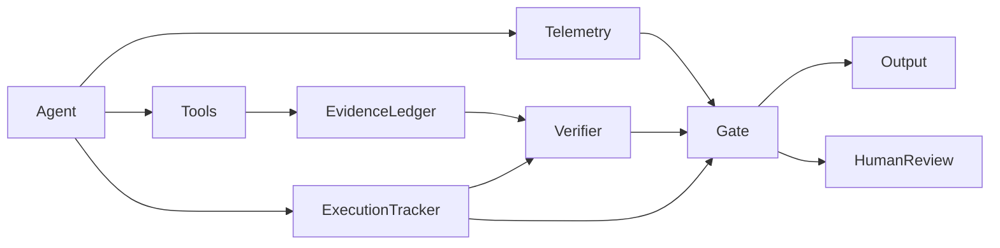

# Ghost Tracker v2 Architecture

Ghost Tracker v2 separates four concerns:

1. Behavioral telemetry — observable agent behavior.
2. Evidence state — what supports each claim.
3. Execution state — what work actually occurred.
4. Governance decision — whether finalization is allowed.

## Hard rule
A favorable behavioral score never overrides a failed evidence or execution condition.




## Point and trajectory model

The 12 behavioral channels are reduced into a three-axis state vector for human glance-level recognition:

```text
P(t) = [X(t), Y(t), Z(t)]
```

The current point describes **state**. The ordered sequence of points describes **trajectory**:

```text
T = {P(t₁), P(t₂), ..., P(tₙ)}
```

A governance decision may therefore use both absolute state and rate/direction of change.

```mermaid
flowchart LR
  C[12 Behavioral Channels] --> A[X/Y/Z Aggregator]
  A --> P[Current Point P(t)]
  P --> V[3D Human-Readable View]
  P --> H[State History]
  H --> D[Trajectory / Delta]
  D --> G[Control Gate]
  P --> G
```

This is a UX-driven compression model: the 3D point is designed to make state recognizable at a glance, while channel-level evidence remains available for explanation and audit.
