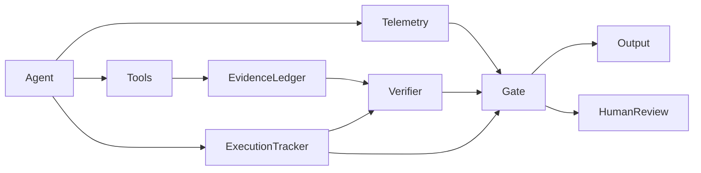

# Ghost Tracker v2 Architecture

Ghost Tracker v2 separates four concerns:

1. Behavioral telemetry — observable agent behavior.
2. Evidence state — what supports each claim.
3. Execution state — what work actually occurred.
4. Governance decision — whether finalization is allowed.

## Hard rule
A favorable behavioral score never overrides a failed evidence or execution condition.

